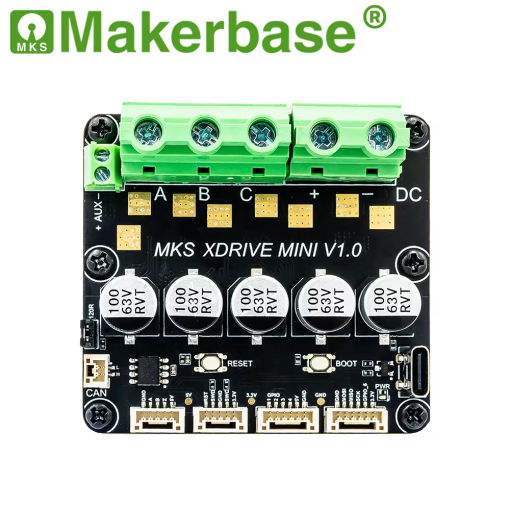

# MKS XDrive Mini - SimpleFOC Firmware

A complete platformio based implementation for the MKS XDrive Mini board firmware using SimpleFOC.
This code is desigend to be a starting point for anyone wishing to start with the MKS XDrive Mini board and SimpleFOC,
providing a comprehensive example of real-time motor control, sensor feedback, and dual communication interfaces (Serial and CAN).

## Overview

This project demonstrates a fully configured BLDC motor controller using the SimpleFOC on MKS XDrive board. It includes:

- **Real-time FOC Algorithm**: 20 kHz FOC loop running on hardware timer (TIM8)
- **Motion Control**: 4 kHz motion control loop for smooth operation
- **Dual Communication**:
  - Serial interface for local monitoring and control (115200 baud)
  - CAN bus communication for distributed motor network control
- **Current Sensing**: Low-side current sense (0.0005Ω shunt) with 80x gain for high resolution
- **Magnetic Sensor**: AS5047 SPI-based encoder for rotor position feedback
- **Web Integration**: Compatible with [webcontroller.simplefoc.com](https://webcontroller.simplefoc.com)

## Hardware

- **MCU**: STM32F405RG (72 MHz, 192 kB RAM)
- **Motor Driver**: DRV8301 with 3-phase half-bridge configuration
- **Current Sensing**: Dual-phase (B and C) with 80x gain
- **Voltage Sensing**: 19:1 voltage divider for power supply monitoring
- **Encoder**: AS5047 magnetic encoder with SPI interface
- **Communication**: USB CDC for Serial, CAN bus via PB8/PB9

Find out more at the [MKS XDrive Mini product page](https://makerbase3d.com/product/makerbase-xdrive-mini-high-precision-brushless-servo-motor-controller-based-on-odrive3-6-with-as5047p-on-board/).

### Communication Interfaces
- **CAN Bus**: PB8 (RX), PB9 (TX) - 1 Mbps bitrate, Node ID 15
- **Serial Debug**: USB CDC over STM32 USB peripheral (115200 baud)

### How to run the code
- Clone the repository and open it in PlatformIO.
- Make sure to update the code with your motor parameters (pole pairs, phase resistance, etc.) in the `setup()` function.
- Build the firmware and flash it to the MKS XDrive Mini board.
  - For uploading, use the built-in USB DFU mode (USB-C connector).
  - To put the board in DFU mode, hold the BOOT button, then press and release the RESET button while still holding BOOT. At the end release the BOOT button. The board should now be in DFU mode and ready for flashing.
- Once the board is running, you can monitor the motor status via the Serial interface using our [web-based webcontroller](https://webcontroller.simplefoc.com) or any serial terminal.
- For CAN communication, connect the board to a CAN bus network and use a compatible CAN interface to send commands and receive feedback.
    - You can find some useful CAN scripts in the `can_scripts/` directory of this repository to help you get started with CAN communication.